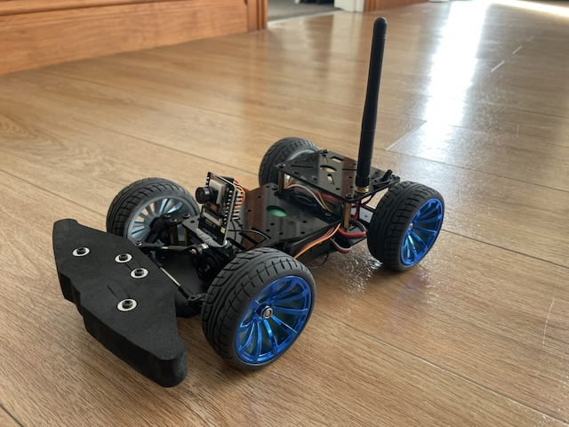
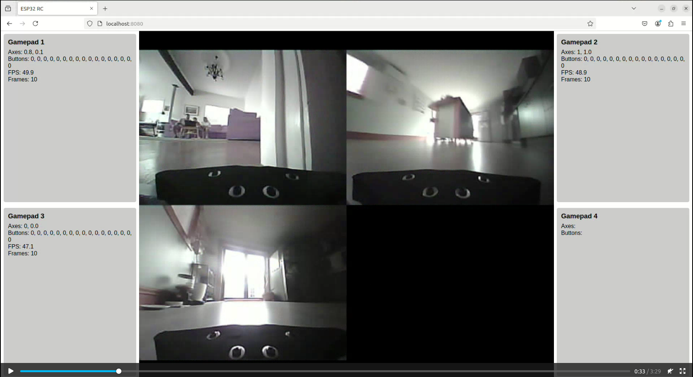
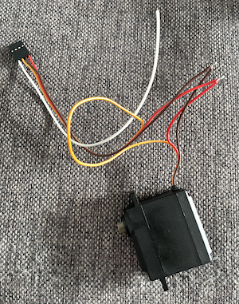
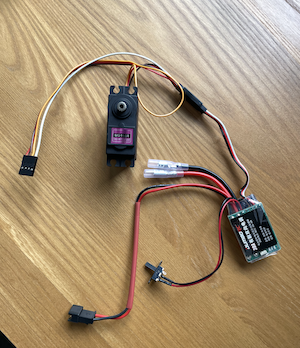

# ESP32 RC Cars





## Demo Video

https://youtu.be/OubYFXmvA1E

A multi-car remote control system using ESP32-CAM modules with live video streaming. Control multiple RC cars simultaneously from a web browser using gamepads, with all video feeds displayed in a dynamic grid layout.

## Features

- **Live Video Streaming** - Real-time MJPEG video from ESP32-CAM to browser
- **Multi-Car Support** - Control multiple cars simultaneously with multiple gamepads
- **Dual Control Modes** - Bluetooth gamepad (direct) or WebSocket (via server)
- **Dynamic Video Grid** - Server automatically arranges video feeds in optimal layout
- **Auto-Reconnection** - ESP32 and browser automatically reconnect on connection loss
- **Safety Timeout** - Motors automatically stop if connection is lost
- **Gamepad Remapping** - Support for different controller axis configurations

---

## Architecture

```
┌─────────────────┐     ┌─────────────────┐     ┌─────────────────┐
│   Browser +     │     │  Python Server  │     │   ESP32-CAM     │
│   Gamepad       │     │   (aiohttp)     │     │   + RC Car      │
├─────────────────┤     ├─────────────────┤     ├─────────────────┤
│                 │     │                 │     │                 │
│  Gamepad API ───┼────►│  WebSocket ─────┼────►│  Motor (ESC)    │
│  (30ms poll)    │     │  Handler        │     │  Servo          │
│                 │     │                 │     │                 │
│  Video  ◄──┼─────┤◄─ MJPEG Stream  │◄────┼── Camera        │
│  (MJPEG)        │     │   /video        │     │  (QVGA JPEG)    │
│                 │     │                 │     │                 │
│  Status UI ◄────┼─────┤  Frame Grid     │     │  WiFi Client    │
│                 │     │  Compositor     │     │                 │
└─────────────────┘     └─────────────────┘     └─────────────────┘
        │                       │                       │
        └───── WebSocket ───────┴────── WebSocket ──────┘
              (commands)              (video frames)
```

### Data Flow

1. **Gamepad → Server**: Browser polls gamepad at 30ms intervals, sends throttle/steering as JSON
2. **Server → ESP32**: Server relays commands to corresponding ESP32 via WebSocket
3. **ESP32 → Server**: ESP32 sends JPEG frames as binary WebSocket messages
4. **Server → Browser**: Server composites all frames into grid, streams as MJPEG

### Control Modes

| Mode | Connection | Use Case |
|------|------------|----------|
| **Bluetooth** | PS4/Xbox controller → ESP32 directly | Single car, low latency |
| **WebSocket** | Browser gamepad → Server → ESP32 | Multi-car, video streaming |

---

## Hardware Requirements

- **ESP32-CAM** (AI Thinker module with external antenna recommended)
  - 170° fisheye camera lens for better FOV
- **RC Car Chassis** with steering servo
- **Electronic Speed Controller (ESC)** - 30A recommended for 5V/3A BEC
- **Battery** - 2x 18650 cells or 7.4V LiPo pack
- **Bluetooth Gamepad** (PS4, Xbox, or compatible) for Bluetooth mode

### Materials (AliExpress Links)

- Car chassis: https://s.click.aliexpress.com/e/_opUxSdp
- ESC (30A): https://s.click.aliexpress.com/e/_oF12WIj
- Battery holder: https://s.click.aliexpress.com/e/_onDYLjZ
- ESP32-CAM: https://www.aliexpress.com/item/1005001468076374.html

---

## Wiring

Connect the servo and ESC to the ESP32-CAM using a 4-pin JST connector:

| ESP32 Pin | Connection |
|-----------|------------|
| GPIO 12   | Steering Servo (signal) |
| GPIO 13   | ESC (signal) |
| 5V        | Servo + ESC power (from ESC BEC) |
| GND       | Common ground |

 

---

## Software Setup

### ESP32 Firmware

#### Prerequisites

- Arduino IDE or PlatformIO
- ESP32 board support package
- Required libraries:
  - `ArduinoWebsockets`
  - `ESP32Servo`
  - `Bluepad32` (for Bluetooth mode)

#### Configuration

1. Copy `secrets.h.example` to `secrets.h`:
   ```bash
   cp secrets.h.example secrets.h
   ```

2. Edit `secrets.h` with your settings:
   ```cpp
   #define WIFI_SSID "YourWiFiSSID"
   #define WIFI_PASSWORD "YourWiFiPassword"
   #define WS_SERVER_URL "ws://192.168.1.100:8080/ws"
   ```

3. Select control mode in `esp32_rc_cars.ino`:
   ```cpp
   // Uncomment ONE of these:
   // #include "web_control.h"      // WebSocket mode (with video)
   #include "bluetooth_control.h"   // Bluetooth gamepad mode
   ```

4. Upload to ESP32-CAM

### Python Server

#### Prerequisites

```bash
cd web_socket_server
pip install -r requirements.txt
```

Or on Debian/Ubuntu:
```bash
sudo apt install python3-aiohttp python3-opencv python3-numpy
```

#### Running the Server

```bash
cd web_socket_server
python app.py
```

Server starts at `http://localhost:8080`

#### Environment Variables

| Variable | Default | Description |
|----------|---------|-------------|
| `HOST` | `0.0.0.0` | Bind address |
| `PORT` | `8080` | Server port |
| `FRAME_RATE` | `30` | Target FPS |
| `MAX_EXPECTED_CLIENTS` | `8` | Max ESP32 connections |

---

## Usage

### WebSocket Mode (Multi-Car with Video)

1. Start the Python server
2. Power on ESP32 car(s) - they auto-connect to the server
3. Open `http://server-ip:8080` in browser
4. Connect gamepad(s) to your computer
5. Each gamepad controls one car (in order of connection)

### Bluetooth Mode (Single Car, Direct)

1. Upload firmware with `bluetooth_control.h` enabled
2. Power on ESP32 car
3. Put PS4/Xbox controller in pairing mode
4. Controller connects directly to ESP32

### WebSocket Commands

Send commands via WebSocket to `/ws`:

| Command | Format | Example |
|---------|--------|---------|
| Motor only | `MOTOR:<speed>` | `MOTOR:128` |
| Servo only | `SERVO:<angle>` | `SERVO:45` |
| Combined | `CONTROL:<speed>:<angle>` | `CONTROL:200:90` |

- Speed: -255 (full reverse) to 255 (full forward)
- Angle: 0 (full left) to 180 (full right), 90 = center

---

## Project Structure

```
esp32_rc_cars/
├── esp32_rc_cars.ino      # Main sketch (select control mode here)
├── config.h               # Hardware configuration constants
├── secrets.h              # WiFi credentials (git-ignored)
├── secrets.h.example      # Template for secrets.h
│
├── Controllable.h         # Interface for controllable components
├── ServoControl.h/cpp     # Steering servo driver
├── Esc.h/cpp              # Motor ESC driver
├── SteeringServo.h        # Alias for ServoControl
│
├── bluetooth_control.h    # Bluetooth gamepad control mode
├── web_control.h          # WebSocket control mode with camera
│
└── web_socket_server/
    ├── app.py             # Server entry point
    ├── server.py          # HTTP/video endpoints
    ├── ws_handlers.py     # WebSocket message handling
    ├── video_utils.py     # Frame processing
    ├── config.py          # Server configuration
    ├── cleanup.py         # Graceful shutdown
    ├── requirements.txt   # Python dependencies
    └── static/
        ├── index.html     # Web interface
        ├── app.js         # Gamepad & WebSocket client
        └── app.css        # Styling
```

---

## Troubleshooting

### Connection Issues

- **ESP32 won't connect to WiFi**: Check credentials in `secrets.h`, ensure 2.4GHz network
- **WebSocket connection fails**: Verify server IP in `WS_SERVER_URL`, check firewall
- **Frequent disconnections**: Use external antenna on ESP32-CAM, reduce distance

### Video Issues

- **No video**: Check camera initialization in serial monitor, ensure adequate power
- **Low FPS**: Reduce `FRAME_RATE`, check WiFi signal strength
- **Black frames**: Camera may need more light, check camera ribbon cable

### Control Issues

- **Motors don't respond**: Check ESC calibration, verify wiring
- **Steering reversed**: Swap min/max angles in `config.h`
- **Gamepad not detected**: Use HTTPS or localhost (Gamepad API requirement)

---

## Suggested Features

Here are some ideas for future enhancements:

### High Priority
- [ ] **HTTPS/WSS Support** - Secure connections for remote access
- [ ] **Authentication** - Password protection for control access
- [ ] **Mobile Touch Controls** - On-screen joystick for phones/tablets
- [ ] **Latency Display** - Show round-trip time in UI

### Medium Priority
- [ ] **Recording** - Save video streams to file
- [ ] **Headlights/Horn** - Control additional GPIO outputs
- [ ] **Battery Monitor** - Display voltage/percentage in UI
- [ ] **Speed Profiles** - Beginner/Advanced throttle curves
- [ ] **Telemetry Overlay** - Speed, steering angle on video

### Low Priority / Fun Ideas
- [ ] **Autonomous Mode** - Line following or obstacle avoidance
- [ ] **VR/AR Support** - Stereoscopic camera for headset viewing
- [ ] **Voice Control** - "Go forward", "Turn left" commands
- [ ] **Race Mode** - Lap timing with IR sensors
- [ ] **Caravan Mode** - Multiple cars follow the leader

### Code Quality
- [ ] **Unit Tests** - Test servo mapping, frame processing
- [ ] **CI/CD Pipeline** - Automated builds and linting
- [ ] **Docker Image** - Containerized server deployment
- [ ] **PlatformIO Support** - Alternative to Arduino IDE

---

## License

This project is open-source and available under the MIT License.

---

## Contributing

Contributions are welcome! Please feel free to submit issues or pull requests.

1. Fork the repository
2. Create a feature branch (`git checkout -b feature/amazing-feature`)
3. Commit your changes (`git commit -m 'Add amazing feature'`)
4. Push to the branch (`git push origin feature/amazing-feature`)
5. Open a Pull Request
